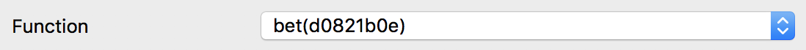
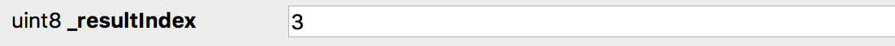
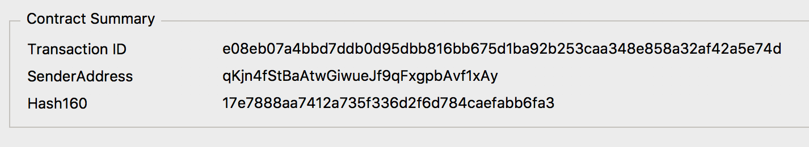
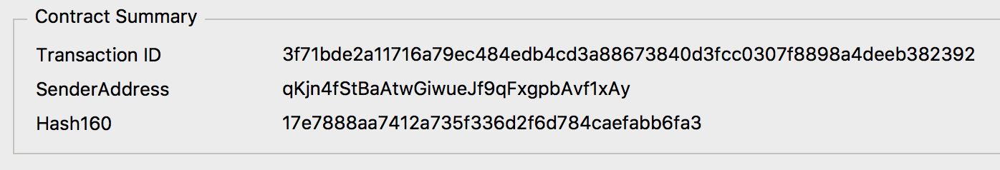

# Interface (ABI)
<textarea id="centralized_oracle_abi" class="abi" readonly rows="2">
[{"constant":true,"inputs":[],"name":"resultIndex","outputs":[{"name":"","type":"uint8"}],"payable":false,"stateMutability":"view","type":"function"},{"constant":true,"inputs":[],"name":"bettingEndBlock","outputs":[{"name":"","type":"uint256"}],"payable":false,"stateMutability":"view","type":"function"},{"constant":true,"inputs":[],"name":"version","outputs":[{"name":"","type":"uint16"}],"payable":false,"stateMutability":"view","type":"function"},{"constant":true,"inputs":[],"name":"oracle","outputs":[{"name":"","type":"address"}],"payable":false,"stateMutability":"view","type":"function"},{"constant":false,"inputs":[{"name":"_resultIndex","type":"uint8"}],"name":"setResult","outputs":[],"payable":false,"stateMutability":"nonpayable","type":"function"},{"constant":true,"inputs":[],"name":"getBetBalances","outputs":[{"name":"","type":"uint256[11]"}],"payable":false,"stateMutability":"view","type":"function"},{"constant":true,"inputs":[],"name":"owner","outputs":[{"name":"","type":"address"}],"payable":false,"stateMutability":"view","type":"function"},{"constant":true,"inputs":[],"name":"getVoteBalances","outputs":[{"name":"","type":"uint256[11]"}],"payable":false,"stateMutability":"view","type":"function"},{"constant":true,"inputs":[],"name":"getTotalVotes","outputs":[{"name":"","type":"uint256[11]"}],"payable":false,"stateMutability":"view","type":"function"},{"constant":true,"inputs":[],"name":"getTotalBets","outputs":[{"name":"","type":"uint256[11]"}],"payable":false,"stateMutability":"view","type":"function"},{"constant":true,"inputs":[],"name":"resultSettingStartBlock","outputs":[{"name":"","type":"uint256"}],"payable":false,"stateMutability":"view","type":"function"},{"constant":true,"inputs":[],"name":"INVALID_RESULT_INDEX","outputs":[{"name":"","type":"uint8"}],"payable":false,"stateMutability":"view","type":"function"},{"constant":true,"inputs":[],"name":"finished","outputs":[{"name":"","type":"bool"}],"payable":false,"stateMutability":"view","type":"function"},{"constant":true,"inputs":[],"name":"numOfResults","outputs":[{"name":"","type":"uint8"}],"payable":false,"stateMutability":"view","type":"function"},{"constant":false,"inputs":[{"name":"_resultIndex","type":"uint8"}],"name":"bet","outputs":[],"payable":true,"stateMutability":"payable","type":"function"},{"constant":true,"inputs":[],"name":"resultSettingEndBlock","outputs":[{"name":"","type":"uint256"}],"payable":false,"stateMutability":"view","type":"function"},{"constant":true,"inputs":[],"name":"bettingStartBlock","outputs":[{"name":"","type":"uint256"}],"payable":false,"stateMutability":"view","type":"function"},{"constant":false,"inputs":[{"name":"_newOwner","type":"address"}],"name":"transferOwnership","outputs":[],"payable":false,"stateMutability":"nonpayable","type":"function"},{"constant":true,"inputs":[],"name":"consensusThreshold","outputs":[{"name":"","type":"uint256"}],"payable":false,"stateMutability":"view","type":"function"},{"constant":true,"inputs":[],"name":"eventAddress","outputs":[{"name":"","type":"address"}],"payable":false,"stateMutability":"view","type":"function"},{"inputs":[{"name":"_version","type":"uint16"},{"name":"_owner","type":"address"},{"name":"_eventAddress","type":"address"},{"name":"_numOfResults","type":"uint8"},{"name":"_oracle","type":"address"},{"name":"_bettingStartBlock","type":"uint256"},{"name":"_bettingEndBlock","type":"uint256"},{"name":"_resultSettingStartBlock","type":"uint256"},{"name":"_resultSettingEndBlock","type":"uint256"},{"name":"_consensusThreshold","type":"uint256"}],"payable":false,"stateMutability":"nonpayable","type":"constructor"},{"payable":true,"stateMutability":"payable","type":"fallback"},{"anonymous":false,"inputs":[{"indexed":true,"name":"_version","type":"uint16"},{"indexed":true,"name":"_oracleAddress","type":"address"},{"indexed":true,"name":"_participant","type":"address"},{"indexed":false,"name":"_resultIndex","type":"uint8"},{"indexed":false,"name":"_votedAmount","type":"uint256"}],"name":"OracleResultVoted","type":"event"},{"anonymous":false,"inputs":[{"indexed":true,"name":"_version","type":"uint16"},{"indexed":true,"name":"_oracleAddress","type":"address"},{"indexed":false,"name":"_resultIndex","type":"uint8"}],"name":"OracleResultSet","type":"event"},{"anonymous":false,"inputs":[{"indexed":true,"name":"_previousOwner","type":"address"},{"indexed":true,"name":"_newOwner","type":"address"}],"name":"OwnershipTransferred","type":"event"}]
</textarea>
<button class="btn" data-clipboard-target="#centralized_oracle_abi">Copy ABI</button>
Copied!

# Function Signatures

    bb235d67: INVALID_RESULT_INDEX()
    d0821b0e: bet(uint8)
    12ca9ed5: bettingEndBlock()
    e04c1e63: bettingStartBlock()
    f9b0b5b9: consensusThreshold()
    fad56779: eventAddress()
    bef4876b: finished()
    871169b9: getBetBalances()
    a3cb679d: getTotalBets()
    9a0e7d66: getTotalVotes()
    95d3382a: getVoteBalances()
    ca381d2e: numOfResults()
    7dc0d1d0: oracle()
    8da5cb5b: owner()
    0d4e8aed: resultIndex()
    d16e637b: resultSettingEndBlock()
    b6fadfb7: resultSettingStartBlock()
    80ce60d1: setResult(uint8)
    f2fde38b: transferOwnership(address)
    54fd4d50: version()

# Event Hashes

    event OracleResultVoted(uint16 indexed _version, address indexed _oracleAddress, address indexed _participant, uint8 _resultIndex, uint256 _votedAmount)
    999983c5b5c285890ab4b2b91f9a82d0ca95784c9b138bd37110ba06faa45f67

    event OracleResultSet(address indexed _oracleAddress, uint8 _resultIndex)
    // TODO

    event OracleInvalidated(address indexed _oracleAddress)
    // TODO

# bet()
Places a bet on a result given the index. The QTUM is routed to the TopicEvent contract for storage.

1. [Launch QT Wallet](../qtum/qt_wallet.md#launch-qt-wallet)
2. Click on `Smart Contract` tab, then click on `SendTo` sub tab
3. Set the `Contract Address` and [Interface (ABI)](#interface-abi)
4. Set the `Function` to `bet(d0821b0e)`

    

5. Set the Result Index you would like to bet in `uint8 _resultIndex` field

    

6. Set the amount of QTUM to bet in the `Amount` field

    

7. Set the `Sender Address` as the address you want to bet from

    

8. Click `Send To Contract` button
9. You should see your new transaction posted. Save the transaction id if you want to verify the transaction succeeded.

    
    
11. Wait for the transaction to get mined

# setResult()
The CentralizedOracle can set the result by first approving 100 BOT (the consensus threshold) to the TopicEvent address. The CentralizedOracle can call this method to set the result between the [betting end block](#bettingendblock) and the [result setting end block](#resultsettingendblock).

1. [Launch QT Wallet](../qtum/qt_wallet.md#launch-qt-wallet)
2. [approve()](../bodhi_token/qt_wallet_desktop.md#approve-bot) `10000000000` Botoshi (100 BOT) which is the current consensus threshold for CentralizedOracles. The `_spender` should be the `TopicEvent` address.
3. Click on `Smart Contract` tab, then click on `SendTo` sub tab
4. Set the `Contract Address` and [Interface (ABI)](#interface-abi)
5. Set the `Function` to `setResult(80ce60d1)`

    

6. Set the Result Index you would like to set the result in `uint8 _resultIndex` field

    

7. Set the `Gas Limit` to `3000000` (3 million) to make sure the transaction goes through. Any unspent gas will be returned to you.

    

8. Set the `Sender Address` as the CentralizedOracle address

    

9. Click `Send To Contract` button
10. You should see your new transaction posted. Save the transaction id if you want to verify the transaction succeeded.

    

11. Wait for your transaction to be mined

# invalidateOracle()
If the CentralizedOracle does not set the result by the result setting end block, anyone can call this method to invalidate the CentralizedOracle. This will create a new DecentralizedOracle and start a new BOT voting round. All results will be available to vote on.

1. [Launch QT Wallet](../qtum/qt_wallet.md#launch-qt-wallet)
2. Click on `Smart Contract` tab, then click on `SendTo` sub tab
3. Set the `Contract Address` and [Interface (ABI)](#interface-abi)
4. Set the `Function` to `invalidateOracle(2f64452e)`
    
    

5. Set the `Gas Limit` to `3000000` (3 million) to make sure the transaction goes through. Any unused gas will be returned to you.

    

6. Set the `Sender Address` as the CentralizedOracle address
7. Click `Send To Contract` button
8. Your transaction is posted. Save the transaction id if you want to verify the transaction succeeded.

    

9. Wait for your transaction to be mined

# eventAddress()
Returns the Event address.

1. [Launch QT Wallet](../qtum/qt_wallet.md#launch-qt-wallet)
2. Click on `Smart Contract` tab, then click on `Call` sub tab
3. Set the `Contract Address` and [Interface (ABI)](#interface-abi)
4. Set the `Function` to `eventAddress(fad56779)`
5. Click `Call Contract` button
6. Returns: 
    * `address` is the Event address

# getEventName()
Returns the event name.

1. [Launch QT Wallet](../qtum/qt_wallet.md#launch-qt-wallet)
2. Click on `Smart Contract` tab, then click on `Call` sub tab
3. Set the `Contract Address` and [Interface (ABI)](#interface-abi)
4. Set the `Function` to `getEventName(b81e43fc)`
5. Click `Call Contract` button
6. Returns:
    * `string` is the Event name

# getEventResultName()
Returns the event name given the Event result index.

1. [Launch QT Wallet](../qtum/qt_wallet.md#launch-qt-wallet)
2. Click on `Smart Contract` tab, then click on `Call` sub tab
3. Set the `Contract Address` and [Interface (ABI)](#interface-abi)
4. Set the `Function` to `getEventResultName(4cb15529)`
5. Click `Call Contract` button
6. Set the `uint8 _eventResultIndex`
7. Returns:
    * `string` is the Event result name

# numOfResults()
Returns the number of Event results.

1. [Launch QT Wallet](../qtum/qt_wallet.md#launch-qt-wallet)
2. Click on `Smart Contract` tab, then click on `Call` sub tab
3. Set the `Contract Address` and [Interface (ABI)](#interface-abi)
4. Set the `Function` to `numOfResults(ca381d2e)`
5. Click `Call Contract` button
6. Returns:
    * `uint8` is the number of Event results

# consensusThreshold()
Returns the consensus threshold that needs to be reached in order for the Oracle to be valid.

1. [Launch QT Wallet](../qtum/qt_wallet.md#launch-qt-wallet)
2. Click on `Smart Contract` tab, then click on `Call` sub tab
3. Set the `Contract Address` and [Interface (ABI)](#interface-abi)
4. Set the `Function` to `consensusThreshold(f9b0b5b9)`
5. Click `Call Contract` button
6. Returns: 
    * `uint256` is the consensus threshold

# oracle()
Returns the address of the CentralizedOracle.

1. [Launch QT Wallet](../qtum/qt_wallet.md#launch-qt-wallet)
2. Click on `Smart Contract` tab, then click on `Call` sub tab
3. Set the `Contract Address` and [Interface (ABI)](#interface-abi)
4. Set the `Function` to `oracle(7dc0d1d0)`
5. Click `Call Contract` button
6. Returns:
    * `address` is the CentralizedOracle in hex

# bettingEndBlock()
Returns the block when the betting period will end.

1. [Launch QT Wallet](../qtum/qt_wallet.md#launch-qt-wallet)
2. Click on `Smart Contract` tab, then click on `Call` sub tab
3. Set the `Contract Address` and [Interface (ABI)](#interface-abi)
4. Set the `Function` to `bettingEndBlock(12ca9ed5)`
5. Click `Call Contract` button
6. Returns:
    * `uint256` is the betting end block

# resultSettingEndBlock()
Returns the block when the CentralizedOracle will no longer be able to set the result.

1. [Launch QT Wallet](../qtum/qt_wallet.md#launch-qt-wallet)
2. Click on `Smart Contract` tab, then click on `Call` sub tab
3. Set the `Contract Address` and [Interface (ABI)](#interface-abi)
4. Set the `Function` to `resultSettingEndBlock(d16e637b)`
5. Click `Call Contract` button
6. Returns:
    * `uint256` is the result setting end block

# getBetBalances()
Returns an array of QTUM bet balances placed by the sender. Shows 10 values and each index is the bet amount for that result index.

1. [Launch QT Wallet](../qtum/qt_wallet.md#launch-qt-wallet)
2. Click on `Smart Contract` tab, then click on `Call` sub tab
3. Set the `Contract Address` and [Interface (ABI)](#interface-abi)
4. Set the `Function` to `getBetBalances(871169b9)`
5. Set the `Sender Address` of the address to get the balances of
6. Click `Call Contract` button
7. Returns:
    * `uint256[10]` is the array of QTUM bet balances shown in Satoshi

# getVoteBalances()
Returns an array of BOT vote balances placed by the sender. Shows 10 values and each index is the vote amount for that result index.

1. [Launch QT Wallet](../qtum/qt_wallet.md#launch-qt-wallet)
2. Click on `Smart Contract` tab, then click on `Call` sub tab
3. Set the `Contract Address` and [Interface (ABI)](#interface-abi)
4. Set the `Function` to `getVoteBalances(95d3382a)`
5. Set the `Sender Address` of the address to get the balances of
7. Click `Call Contract` button
8. Returns:
    * `uint256[10]` is the array of BOT vote balances shown in Botoshi

# getTotalBets()
Returns an array of total QTUM bets placed by all participants. Shows 10 values and each index is the total bet amount for that result.

1. [Launch QT Wallet](../qtum/qt_wallet.md#launch-qt-wallet)
2. Click on `Smart Contract` tab, then click on `Call` sub tab
3. Set the `Contract Address` and [Interface (ABI)](#interface-abi)
4. Set the `Function` to `getTotalBets(a3cb679d)`
5. Click `Call Contract` button
6. Returns:
    * `uint256[10]` is the array of total QTUM bets shown in Satoshi

# getTotalVotes()
Returns an array of total BOT votes placed by all participants. Shows 10 values and each index is the total vote amount for that result.

1. [Launch QT Wallet](../qtum/qt_wallet.md#launch-qt-wallet)
2. Click on `Smart Contract` tab, then click on `Call` sub tab
3. Set the `Contract Address` and [Interface (ABI)](#interface-abi)
4. Set the `Function` to `getTotalVotes(9a0e7d66)`
5. Click `Call Contract` button
6. Returns:
    * `uint256[10]` is the array of total BOT votes shown in Botoshi

# getResult()
Returns the winning result index, name, and true/false indicating if the Oracle is finished. Please note this will return an error if the Oracle is not finished and will return this error:

1. [Launch QT Wallet](../qtum/qt_wallet.md#launch-qt-wallet)
2. Click on `Smart Contract` tab, then click on `Call` sub tab
3. Set the `Contract Address` and [Interface (ABI)](#interface-abi)
4. Set the `Function` to `getResult(de292789)`
5. Click `Call Contract` button
6. Returns:
    * `uint8` is the winning result index
    * `string` is the winning result name
    * `bool` is the flag indicating the result is valid

# finished()
Returns true or false if the Oracle is finished. No more transactions are allowed after finished.

1. [Launch QT Wallet](../qtum/qt_wallet.md#launch-qt-wallet)
2. Click on `Smart Contract` tab, then click on `Call` sub tab
3. Set the `Contract Address` and [Interface (ABI)](#interface-abi)
4. Set the `Function` to `finished(bef4876b)`
5. Click `Call Contract` button
6. Returns:
    * `bool` shows true/false if the Oracle is finished
