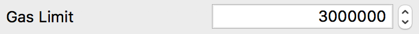

# Interface (ABI)
<textarea id="decentralized_oracle_abi" class="abi" readonly rows="2">
[{"constant":false,"inputs":[],"name":"invalidateOracle","outputs":[],"payable":false,"stateMutability":"nonpayable","type":"function"},{"constant":true,"inputs":[{"name":"_eventResultIndex","type":"uint8"}],"name":"getEventResultName","outputs":[{"name":"","type":"string"}],"payable":false,"stateMutability":"view","type":"function"},{"constant":true,"inputs":[],"name":"arbitrationEndBlock","outputs":[{"name":"","type":"uint256"}],"payable":false,"stateMutability":"view","type":"function"},{"constant":true,"inputs":[],"name":"lastResultIndex","outputs":[{"name":"","type":"uint8"}],"payable":false,"stateMutability":"view","type":"function"},{"constant":false,"inputs":[],"name":"finalizeResult","outputs":[],"payable":false,"stateMutability":"nonpayable","type":"function"},{"constant":true,"inputs":[],"name":"getBetBalances","outputs":[{"name":"","type":"uint256[10]"}],"payable":false,"stateMutability":"view","type":"function"},{"constant":true,"inputs":[],"name":"owner","outputs":[{"name":"","type":"address"}],"payable":false,"stateMutability":"view","type":"function"},{"constant":true,"inputs":[],"name":"getVoteBalances","outputs":[{"name":"","type":"uint256[10]"}],"payable":false,"stateMutability":"view","type":"function"},{"constant":true,"inputs":[],"name":"getTotalVotes","outputs":[{"name":"","type":"uint256[10]"}],"payable":false,"stateMutability":"view","type":"function"},{"constant":false,"inputs":[{"name":"_eventResultIndex","type":"uint8"},{"name":"_botAmount","type":"uint256"}],"name":"voteResult","outputs":[],"payable":false,"stateMutability":"nonpayable","type":"function"},{"constant":true,"inputs":[],"name":"getTotalBets","outputs":[{"name":"","type":"uint256[10]"}],"payable":false,"stateMutability":"view","type":"function"},{"constant":true,"inputs":[],"name":"getEventName","outputs":[{"name":"","type":"string"}],"payable":false,"stateMutability":"view","type":"function"},{"constant":true,"inputs":[],"name":"finished","outputs":[{"name":"","type":"bool"}],"payable":false,"stateMutability":"view","type":"function"},{"constant":true,"inputs":[],"name":"invalidResultIndex","outputs":[{"name":"","type":"uint8"}],"payable":false,"stateMutability":"view","type":"function"},{"constant":true,"inputs":[],"name":"numOfResults","outputs":[{"name":"","type":"uint8"}],"payable":false,"stateMutability":"view","type":"function"},{"constant":true,"inputs":[],"name":"getResult","outputs":[{"name":"","type":"uint8"},{"name":"","type":"string"},{"name":"","type":"bool"}],"payable":false,"stateMutability":"view","type":"function"},{"constant":false,"inputs":[{"name":"_newOwner","type":"address"}],"name":"transferOwnership","outputs":[],"payable":false,"stateMutability":"nonpayable","type":"function"},{"constant":true,"inputs":[],"name":"consensusThreshold","outputs":[{"name":"","type":"uint256"}],"payable":false,"stateMutability":"view","type":"function"},{"constant":true,"inputs":[],"name":"eventAddress","outputs":[{"name":"","type":"address"}],"payable":false,"stateMutability":"view","type":"function"},{"inputs":[{"name":"_owner","type":"address"},{"name":"_eventAddress","type":"address"},{"name":"_eventName","type":"bytes32[10]"},{"name":"_eventResultNames","type":"bytes32[10]"},{"name":"_numOfResults","type":"uint8"},{"name":"_lastResultIndex","type":"uint8"},{"name":"_arbitrationEndBlock","type":"uint256"},{"name":"_consensusThreshold","type":"uint256"}],"payable":false,"stateMutability":"nonpayable","type":"constructor"},{"anonymous":false,"inputs":[{"indexed":true,"name":"_oracleAddress","type":"address"},{"indexed":true,"name":"_participant","type":"address"},{"indexed":false,"name":"_resultIndex","type":"uint8"},{"indexed":false,"name":"_votedAmount","type":"uint256"}],"name":"OracleResultVoted","type":"event"},{"anonymous":false,"inputs":[{"indexed":true,"name":"_oracleAddress","type":"address"},{"indexed":false,"name":"_resultIndex","type":"uint8"}],"name":"OracleResultSet","type":"event"},{"anonymous":false,"inputs":[{"indexed":true,"name":"_oracleAddress","type":"address"}],"name":"OracleInvalidated","type":"event"},{"anonymous":false,"inputs":[{"indexed":true,"name":"_previousOwner","type":"address"},{"indexed":true,"name":"_newOwner","type":"address"}],"name":"OwnershipTransferred","type":"event"}]
</textarea>
<button class="btn" data-clipboard-target="#decentralized_oracle_abi">Copy ABI</button>
Copied!

# Function Signatures

    4f2c07f5: arbitrationEndBlock()
    f9b0b5b9: consensusThreshold()
    fad56779: eventAddress()
    61cac418: finalizeResult()
    bef4876b: finished()
    871169b9: getBetBalances()
    b81e43fc: getEventName()
    4cb15529: getEventResultName(uint8)
    de292789: getResult()
    a3cb679d: getTotalBets()
    9a0e7d66: getTotalVotes()
    95d3382a: getVoteBalances()
    c8ef9028: invalidResultIndex()
    2f64452e: invalidateOracle()
    54750783: lastResultIndex()
    ca381d2e: numOfResults()
    8da5cb5b: owner()
    f2fde38b: transferOwnership(address)
    a34ce8b9: voteResult(uint8,uint256)

# Event Hashes

    event OracleResultVoted(address indexed _oracleAddress, address indexed _participant, uint8 _resultIndex, uint256 _votedAmount)
    // TODO

    event OracleResultSet(address indexed _oracleAddress, uint8 _resultIndex)
    // TODO

    event OracleInvalidated(address indexed _oracleAddress)
    // TODO

# voteResult()
Places a vote with BOT on a result given the index. The BOT is routed to the TopicEvent contract for storage.

1. [Launch QT Wallet](../qtum/qt_wallet.md#launch-qt-wallet)
2. [approve()](../bodhi_token/qt_wallet_desktop.md#approve-bot) the amount of BOT you want to vote with. The `_spender` should be the `TopicEvent` address.
3. Click on `Smart Contract` tab, then click on `SendTo` sub tab
4. Set the `Contract Address` and [Interface (ABI)](#interface-abi)
5. Set the `Function` to `voteResult(a34ce8b9)`
    
    

6. Set the Result Index you would like to vote in `uint8 _eventResultIndex` field. Note this cannot be the equal to the last result index, or your transaction will fail.

    

7. Set the amount of BOT to vote in the `uint256 _botAmount` field. Note that you have to `approve()` this amount to the `TopicEvent` contract address from the BodhiToken contract first.

    

8. If this vote will reach the consensus threshold, set the `Gas Limit` to `3000000` (3 million) to make sure the transaction goes through. If under the threshold, leave it as the default gas limit. Any unused gas will be returned to you. The vote that reaches the consensus threshold will need high gas to create a new DecentralizedOracle contract.

    

9. Set the `Sender Address` as the address you want to vote from

    

10. Click `Send To Contract` button
11. You should see your new transaction posted. Save the transaction id if you want to verify the transaction succeeded.
    
    

12. Wait for the transaction to be mined

# finalizeResult()
If the arbitration end block is reached, the last result index is a valid result, and the consensus threshold has not been surpassed, anyone may call this method to set the final result in the [TopicEvent](topic_event.md). This allows winners to withdraw from the [TopicEvent](topic_event.md).

1. [Launch QT Wallet](../qtum/qt_wallet.md#launch-qt-wallet)
2. Click on `Smart Contract` tab, then click on `SendTo` sub tab
3. Set the `Contract Address` and [Interface (ABI)](#interface-abi)
4. Set the `Function` to `finalizeResult(61cac418)`

    

5. Click `Send To Contract` button
6. Wait for the transaction to be mined

# invalidateOracle()
If this DecentralizedOracle was created by invalidating the last Oracle and does not hit the consensus threshold in time, anyone can call this method to invalidate the DecentralizedOracle. This will create a new DecentralizedOracle and start a new BOT voting round. All results will be available to vote on. You can verify the last Oracle was invalidated when the [last result index](#lastresultindex) is equal to 255.

1. [Launch QT Wallet](../qtum/qt_wallet.md#launch-qt-wallet)
2. Click on `Smart Contract` tab, then click on `SendTo` sub tab
3. Set the `Contract Address` and [Interface (ABI)](#interface-abi)
4. Set the `Function` to `invalidateOracle(2f64452e)`
    
    

5. Set the `Gas Limit` to `3000000` (3 million) to make sure the transaction goes through. Any unused gas will be returned to you.

    

6. Set the `Sender Address` as the CentralizedOracle address
7. Click `Send To Contract` button
8. Your transaction is posted. Save the transaction id if you want to verify the transaction succeeded.

    

9. Wait for your transaction to be mined

# eventAddress()
Returns the Event address.

1. [Launch QT Wallet](../qtum/qt_wallet.md#launch-qt-wallet)
2. Click on `Smart Contract` tab, then click on `Call` sub tab
3. Set the `Contract Address` and [Interface (ABI)](#interface-abi)
4. Set the `Function` to `eventAddress(fad56779)`
5. Click `Call Contract` button
6. Returns:
    * `address` is the Event address

# getEventName()
Returns the event name.

1. [Launch QT Wallet](../qtum/qt_wallet.md#launch-qt-wallet)
2. Click on `Smart Contract` tab, then click on `Call` sub tab
3. Set the `Contract Address` and [Interface (ABI)](#interface-abi)
4. Set the `Function` to `getEventName(b81e43fc)`
5. Click `Call Contract` button
6. Returns:
    * `string` is the Event name

# getEventResultName()
Returns the event name given the Event result index.

1. [Launch QT Wallet](../qtum/qt_wallet.md#launch-qt-wallet)
2. Click on `Smart Contract` tab, then click on `Call` sub tab
3. Set the `Contract Address` and [Interface (ABI)](#interface-abi)
4. Set the `Function` to `getEventResultName(4cb15529)`
5. Click `Call Contract` button
6. Set the `uint8 _eventResultIndex`
7. Returns:
    * `string` is the Event result name

# numOfResults()
Returns the number of Event results.

1. [Launch QT Wallet](../qtum/qt_wallet.md#launch-qt-wallet)
2. Click on `Smart Contract` tab, then click on `Call` sub tab
3. Set the `Contract Address` and [Interface (ABI)](#interface-abi)
4. Set the `Function` to `numOfResults(ca381d2e)`
5. Click `Call Contract` button
6. Returns:
    * `uint8` is the number of Event results

# consensusThreshold()
Returns the consensus threshold that needs to be reached in order for the Oracle to be valid.

1. [Launch QT Wallet](../qtum/qt_wallet.md#launch-qt-wallet)
2. Click on `Smart Contract` tab, then click on `Call` sub tab
3. Set the `Contract Address` and [Interface (ABI)](#interface-abi)
4. Set the `Function` to `consensusThreshold(f9b0b5b9)`
5. Click `Call Contract` button
6. Returns:
    * `uint256` is the consensus threshold

# lastResultIndex()
Returns the last index of the previous oracle.

1. [Launch QT Wallet](../qtum/qt_wallet.md#launch-qt-wallet)
2. Click on `Smart Contract` tab, then click on `Call` sub tab
3. Set the `Contract Address` and [Interface (ABI)](#interface-abi)
4. Set the `Function` to `lastResultIndex(54750783)`
5. Click `Call Contract` button
6. Returns:
    * `uint8` is the last result index

# arbitrationEndBlock()
Returns the block when the voting period will end. 

1. [Launch QT Wallet](../qtum/qt_wallet.md#launch-qt-wallet)
2. Click on `Smart Contract` tab, then click on `Call` sub tab
3. Set the `Contract Address` and [Interface (ABI)](#interface-abi)
4. Set the `Function` to `arbitrationEndBlock(4f2c07f5)`
5. Click `Call Contract` button
6. Returns:
    * `uint256` is the arbitration end block

# getVoteBalances()
Returns an array of BOT vote balances placed by the sender. Shows 10 values and each index is the vote amount for that result index.

1. [Launch QT Wallet](../qtum/qt_wallet.md#launch-qt-wallet)
2. Click on `Smart Contract` tab, then click on `Call` sub tab
3. Set the `Contract Address` and [Interface (ABI)](#interface-abi)
4. Set the `Function` to `getVoteBalances(95d3382a)`
5. Click `Call Contract` button
6. Returns:
    * `uint256[10]` is the array of BOT vote balances shown in Botoshi

# getTotalVotes()
Returns an array of total BOT votes placed by all participants. Shows 10 values and each index is the total vote amount for that result.

1. [Launch QT Wallet](../qtum/qt_wallet.md#launch-qt-wallet)
2. Click on `Smart Contract` tab, then click on `Call` sub tab
3. Set the `Contract Address` and [Interface (ABI)](#interface-abi)
4. Set the `Function` to `getTotalVotes(9a0e7d66)`
5. Click `Call Contract` button
6. Returns:
    * `uint256[10]` is the array of total BOT votes shown in Botoshi

# getResult()
Returns the winning result index, name, and true/false indicating if the Oracle is finished. Please note this will return an error if the Oracle is not finished and will return this error:

1. [Launch QT Wallet](../qtum/qt_wallet.md#launch-qt-wallet)
2. Click on `Smart Contract` tab, then click on `Call` sub tab
3. Set the `Contract Address` and [Interface (ABI)](#interface-abi)
4. Set the `Function` to `getResult(de292789)`
5. Click `Call Contract` button
6. Returns:
    * `uint8` is the winning result index
    * `string` is the winning result name
    * `bool` is the flag indicating the result is valid

# finished()
Returns true or false if the Oracle is finished. No more transactions are allowed after finished.

1. [Launch QT Wallet](../qtum/qt_wallet.md#launch-qt-wallet)
2. Click on `Smart Contract` tab, then click on `Call` sub tab
3. Set the `Contract Address` and [Interface (ABI)](#interface-abi)
4. Set the `Function` to `finished(bef4876b)`
5. Click `Call Contract` button
6. Returns:
    * `bool` shows true/false if the Oracle is finished
