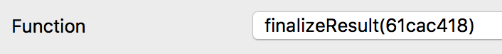

# Interface (ABI)
<textarea id="decentralized_oracle_abi" class="abi" readonly rows="2">
[{"constant":true,"inputs":[],"name":"bettingEndBlock","outputs":[{"name":"","type":"uint256"}],"payable":false,"stateMutability":"view","type":"function"},{"constant":false,"inputs":[{"name":"_resultIndex","type":"uint8"},{"name":"_botAmount","type":"uint256"}],"name":"setResult","outputs":[],"payable":false,"stateMutability":"nonpayable","type":"function"},{"constant":false,"inputs":[],"name":"invalidateOracle","outputs":[],"payable":false,"stateMutability":"nonpayable","type":"function"},{"constant":true,"inputs":[{"name":"_eventResultIndex","type":"uint8"}],"name":"getVotedBalance","outputs":[{"name":"","type":"uint256"}],"payable":false,"stateMutability":"view","type":"function"},{"constant":true,"inputs":[{"name":"_eventResultIndex","type":"uint8"}],"name":"getEventResultName","outputs":[{"name":"","type":"string"}],"payable":false,"stateMutability":"view","type":"function"},{"constant":true,"inputs":[],"name":"oracle","outputs":[{"name":"","type":"address"}],"payable":false,"stateMutability":"view","type":"function"},{"constant":true,"inputs":[],"name":"getResultIndex","outputs":[{"name":"","type":"uint8"}],"payable":false,"stateMutability":"view","type":"function"},{"constant":true,"inputs":[],"name":"owner","outputs":[{"name":"","type":"address"}],"payable":false,"stateMutability":"view","type":"function"},{"constant":true,"inputs":[],"name":"getEventName","outputs":[{"name":"","type":"string"}],"payable":false,"stateMutability":"view","type":"function"},{"constant":true,"inputs":[],"name":"finished","outputs":[{"name":"","type":"bool"}],"payable":false,"stateMutability":"view","type":"function"},{"constant":true,"inputs":[],"name":"invalidResultIndex","outputs":[{"name":"","type":"uint8"}],"payable":false,"stateMutability":"view","type":"function"},{"constant":true,"inputs":[],"name":"numOfResults","outputs":[{"name":"","type":"uint8"}],"payable":false,"stateMutability":"view","type":"function"},{"constant":true,"inputs":[],"name":"currentBalance","outputs":[{"name":"","type":"uint256"}],"payable":false,"stateMutability":"view","type":"function"},{"constant":false,"inputs":[{"name":"_resultIndex","type":"uint8"}],"name":"bet","outputs":[],"payable":true,"stateMutability":"payable","type":"function"},{"constant":true,"inputs":[],"name":"resultSettingEndBlock","outputs":[{"name":"","type":"uint256"}],"payable":false,"stateMutability":"view","type":"function"},{"constant":false,"inputs":[{"name":"_newOwner","type":"address"}],"name":"transferOwnership","outputs":[],"payable":false,"stateMutability":"nonpayable","type":"function"},{"constant":true,"inputs":[],"name":"consensusThreshold","outputs":[{"name":"","type":"uint256"}],"payable":false,"stateMutability":"view","type":"function"},{"constant":true,"inputs":[],"name":"eventAddress","outputs":[{"name":"","type":"address"}],"payable":false,"stateMutability":"view","type":"function"},{"inputs":[{"name":"_owner","type":"address"},{"name":"_oracle","type":"address"},{"name":"_eventAddress","type":"address"},{"name":"_eventName","type":"bytes32[10]"},{"name":"_eventResultNames","type":"bytes32[10]"},{"name":"_numOfResults","type":"uint8"},{"name":"_bettingEndBlock","type":"uint256"},{"name":"_resultSettingEndBlock","type":"uint256"},{"name":"_consensusThreshold","type":"uint256"}],"payable":false,"stateMutability":"nonpayable","type":"constructor"},{"payable":true,"stateMutability":"payable","type":"fallback"},{"anonymous":false,"inputs":[{"indexed":true,"name":"_oracleAddress","type":"address"},{"indexed":true,"name":"_participant","type":"address"},{"indexed":false,"name":"_resultIndex","type":"uint8"},{"indexed":false,"name":"_votedAmount","type":"uint256"}],"name":"OracleResultVoted","type":"event"},{"anonymous":false,"inputs":[{"indexed":true,"name":"_oracleAddress","type":"address"},{"indexed":false,"name":"_resultIndex","type":"uint8"}],"name":"OracleResultSet","type":"event"},{"anonymous":false,"inputs":[{"indexed":true,"name":"_oracleAddress","type":"address"}],"name":"OracleInvalidated","type":"event"},{"anonymous":false,"inputs":[{"indexed":true,"name":"_previousOwner","type":"address"},{"indexed":true,"name":"_newOwner","type":"address"}],"name":"OwnershipTransferred","type":"event"}]
</textarea>
<button class="btn" data-clipboard-target="#decentralized_oracle_abi">Copy ABI</button>
Copied!

# Event Hashes

    event OracleResultVoted(address indexed _oracleAddress, address indexed _participant, uint8 _resultIndex, uint256 _votedAmount)
    0f6520c85c2e282b6c54e14e5b424ca7eafc89615f05f2d35f3c1f9110e9df03

    event OracleResultSet(address indexed _oracleAddress, uint8 _resultIndex)
    b42c9ac580dc82ad43bf9a1b2262e16b53f647e722089b93ebae1479032fc221

# voteResult()
Places a vote with BOT on a result given the index. The BOT is routed to the TopicEvent contract for storage.

1. [Launch QT Wallet](../qtum/qt_wallet.md#launch-qt-wallet)
2. [approve()](../bodhi_token/qt_wallet_desktop.md#approve-bot) the amount of BOT you want to vote with. The `_spender` should be the `TopicEvent` address.
3. Click on `Smart Contract` tab, then click on `SendTo` sub tab
4. Set the `Contract Address` and [Interface (ABI)](#interface-abi)
5. Set the `Function` to `voteResult(a34ce8b9)`
6. Set the Result Index you would like to vote in `uint8 _eventResultIndex` field. Note this cannot be the equal to the last result index, or your transaction will fail.

    

7. Set the amount of BOT to vote in the `uint256 _botAmount` field. Note that you have to `approve()` this amount to the `TopicEvent` contract address from the BodhiToken contract first.

    

8. Set the `Sender Address` as the address you want to vote from

    

9. Click `Send To Contract` button
10. You should see your new transaction posted. Save the transaction id if you want to verify the transaction succeeded.
    
    

11. Wait for the transaction to be mined

# finalizeResult()
If the arbitration end block is reached, the last result index is a valid result, and the consensus threshold has not been surpassed, anyone may call this method to set the final result in the [TopicEvent](topic_event.md). This allows winners to withdraw from the [TopicEvent](topic_event.md).

1. [Launch QT Wallet](../qtum/qt_wallet.md#launch-qt-wallet)
2. Click on `Smart Contract` tab, then click on `SendTo` sub tab
3. Set the `Contract Address` and [Interface (ABI)](#interface-abi)
4. Set the `Function` to `finalizeResult(61cac418)`

    

5. Click `Send To Contract` button
6. Wait for the transaction to be mined
