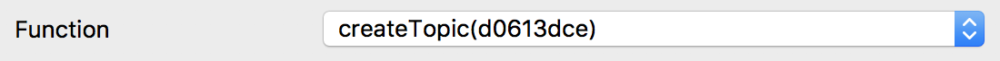
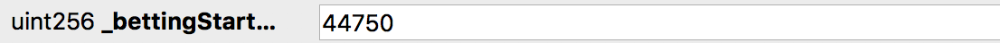
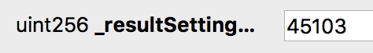
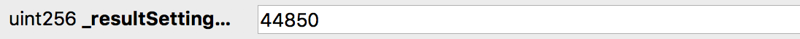

# Deployed Contracts

**QTUM Testnet**

* EventFactory: `f440a14ed367381058d9b517f30b0bca60c8e0f5`

# Interface (ABI)
<textarea id="event_factory_abi" class="abi" readonly rows="2">
[{"constant":true,"inputs":[{"name":"","type":"bytes32"}],"name":"topics","outputs":[{"name":"","type":"address"}],"payable":false,"stateMutability":"view","type":"function"},{"constant":false,"inputs":[{"name":"_oracle","type":"address"},{"name":"_name","type":"bytes32[10]"},{"name":"_resultNames","type":"bytes32[10]"},{"name":"_bettingEndBlock","type":"uint256"},{"name":"_resultSettingEndBlock","type":"uint256"}],"name":"createTopic","outputs":[{"name":"topicEvent","type":"address"}],"payable":false,"stateMutability":"nonpayable","type":"function"},{"constant":true,"inputs":[{"name":"_name","type":"bytes32[10]"},{"name":"_resultNames","type":"bytes32[10]"},{"name":"_bettingEndBlock","type":"uint256"},{"name":"_resultSettingEndBlock","type":"uint256"}],"name":"doesTopicExist","outputs":[{"name":"","type":"bool"}],"payable":false,"stateMutability":"view","type":"function"},{"inputs":[{"name":"_addressManager","type":"address"}],"payable":false,"stateMutability":"nonpayable","type":"constructor"},{"anonymous":false,"inputs":[{"indexed":true,"name":"_topicAddress","type":"address"},{"indexed":true,"name":"_creator","type":"address"},{"indexed":true,"name":"_oracle","type":"address"},{"indexed":false,"name":"_name","type":"bytes32[10]"},{"indexed":false,"name":"_resultNames","type":"bytes32[10]"},{"indexed":false,"name":"_bettingEndBlock","type":"uint256"},{"indexed":false,"name":"_resultSettingEndBlock","type":"uint256"}],"name":"TopicCreated","type":"event"}]
</textarea>
<button class="btn" data-clipboard-target="#event_factory_abi">Copy ABI</button>
Copied!

# Function Signatures

    d0613dce: createTopic(address,bytes32[10],bytes32[10],uint256,uint256)
    fe782f51: doesTopicExist(bytes32[10],bytes32[10],uint256,uint256)
    0f2fbeec: topics(bytes32)

# Event Hashes

    event TopicCreated(address indexed _topicAddress, address indexed _creator, address indexed _oracle, bytes32[10] _name, bytes32[10] _resultNames, uint256 _bettingEndBlock, uint256 _resultSettingEndBlock)
    b7fa6f4e0c226cf0645f9f983dbc0bb4bb971400b98fae2387487d6d810c9c56

# Creating TopicEvent
1. [Launch QT Wallet](../qtum/qt_wallet.md#launch-qt-wallet)
2. Click on `Smart Contract` tab
3. Click on `SendTo` sub tab
4. Set the [Contract Address](#deployed-contracts) and [Interface (ABI)](#interface-abi)

    

5. Set the `Function` to `createTopic(d0613dce)`

    

6. Set the [hash address](../qtum/qt_wallet.md#convert-qtum-address-to-hash) of the CentralizedOracle in `address _oracle` field

    

7. Set the TopicEvent name broken down by 32 byte blocks converted to hex in the `bytes32[10] _name` fields. These blocks need to be right-padded to 32 bytes. 

    

        # Field 1
        # "Who will be the next president i" = 
        # 57686f2077696c6c20626520746865206e65787420707265736964656e742069 in hex

        # Field 2
        # "n the 2020 election?" = 
        # 6e20746865203230323020656c656374696f6e3f000000000000000000000000 in hex

        # Fields 3-10
        # empty strings = 
        # 0000000000000000000000000000000000000000000000000000000000000000 in hex

8. Set the TopicEvent result names converted to hex in the `bytes32[10] _resultName` fields. Same as the name fields, these blocks need to be right-padded to 32 bytes.

    

        # Field 1
        # "Trump" = 
        # 5472756d70000000000000000000000000000000000000000000000000000000 in hex

        # Field 2
        # "Hilary" = 
        # 48696c6172790000000000000000000000000000000000000000000000000000 in hex

        # Field 3
        # "The Rock" = 
        # 54686520526f636b000000000000000000000000000000000000000000000000 in hex

        # Field 4
        # "Kanye West" = 
        # 4b616e7965205765737400000000000000000000000000000000000000000000 in hex

9. Set the betting end block in the `uint256 _bettingEndBlock` field. This needs to be greater than the current block.

    

10. Set the result setting end block in the `uint256 _resultSettingEndBlock` field. This needs to be greater than the `bettingEndBlock`.

    

11. Set the `Gas Limit` to `4000000` (4 million gas just to be safe the transaction goes through, unused gas will be returned to you in the next coinstake transaction)

    

12. Set the `Sender Address`

    

13. Click `Send To Contract` button
14. Wait for transaction to get mined

    
