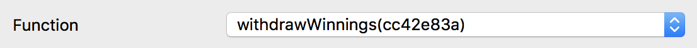

# Interface (ABI)
<textarea id="topic_event_abi" class="abi" readonly rows="2">
[{"constant":false,"inputs":[{"name":"_resultIndex","type":"uint8"},{"name":"_sender","type":"address"},{"name":"_amount","type":"uint256"}],"name":"voteFromOracle","outputs":[{"name":"","type":"bool"}],"payable":false,"stateMutability":"nonpayable","type":"function"},{"constant":true,"inputs":[],"name":"totalBotValue","outputs":[{"name":"","type":"uint256"}],"payable":false,"stateMutability":"view","type":"function"},{"constant":true,"inputs":[{"name":"_oracleIndex","type":"uint8"}],"name":"getOracle","outputs":[{"name":"","type":"address"},{"name":"","type":"bool"}],"payable":false,"stateMutability":"view","type":"function"},{"constant":true,"inputs":[{"name":"","type":"address"}],"name":"didWithdraw","outputs":[{"name":"","type":"bool"}],"payable":false,"stateMutability":"view","type":"function"},{"constant":true,"inputs":[],"name":"resultSet","outputs":[{"name":"","type":"bool"}],"payable":false,"stateMutability":"view","type":"function"},{"constant":true,"inputs":[],"name":"status","outputs":[{"name":"","type":"uint8"}],"payable":false,"stateMutability":"view","type":"function"},{"constant":true,"inputs":[],"name":"getFinalResult","outputs":[{"name":"","type":"uint8"},{"name":"","type":"string"},{"name":"","type":"bool"}],"payable":false,"stateMutability":"view","type":"function"},{"constant":true,"inputs":[{"name":"","type":"uint256"}],"name":"resultNames","outputs":[{"name":"","type":"bytes32"}],"payable":false,"stateMutability":"view","type":"function"},{"constant":true,"inputs":[{"name":"","type":"uint256"}],"name":"oracles","outputs":[{"name":"didSetResult","type":"bool"},{"name":"oracleAddress","type":"address"}],"payable":false,"stateMutability":"view","type":"function"},{"constant":false,"inputs":[],"name":"finalizeResult","outputs":[{"name":"","type":"bool"}],"payable":false,"stateMutability":"nonpayable","type":"function"},{"constant":false,"inputs":[{"name":"_oracle","type":"address"},{"name":"_resultIndex","type":"uint8"},{"name":"_consensusThreshold","type":"uint256"}],"name":"centralizedOracleSetResult","outputs":[],"payable":false,"stateMutability":"nonpayable","type":"function"},{"constant":true,"inputs":[],"name":"totalQtumValue","outputs":[{"name":"","type":"uint256"}],"payable":false,"stateMutability":"view","type":"function"},{"constant":false,"inputs":[{"name":"_consensusThreshold","type":"uint256"}],"name":"invalidateOracle","outputs":[],"payable":false,"stateMutability":"nonpayable","type":"function"},{"constant":true,"inputs":[],"name":"getBetBalances","outputs":[{"name":"","type":"uint256[10]"}],"payable":false,"stateMutability":"view","type":"function"},{"constant":true,"inputs":[],"name":"owner","outputs":[{"name":"","type":"address"}],"payable":false,"stateMutability":"view","type":"function"},{"constant":true,"inputs":[],"name":"calculateQtumContributorWinnings","outputs":[{"name":"","type":"uint256"}],"payable":false,"stateMutability":"view","type":"function"},{"constant":true,"inputs":[],"name":"getVoteBalances","outputs":[{"name":"","type":"uint256[10]"}],"payable":false,"stateMutability":"view","type":"function"},{"constant":true,"inputs":[],"name":"getTotalVotes","outputs":[{"name":"","type":"uint256[10]"}],"payable":false,"stateMutability":"view","type":"function"},{"constant":false,"inputs":[{"name":"_better","type":"address"},{"name":"_resultIndex","type":"uint8"}],"name":"bet","outputs":[],"payable":true,"stateMutability":"payable","type":"function"},{"constant":false,"inputs":[{"name":"_resultIndex","type":"uint8"},{"name":"_currentConsensusThreshold","type":"uint256"}],"name":"votingOracleSetResult","outputs":[{"name":"","type":"bool"}],"payable":false,"stateMutability":"nonpayable","type":"function"},{"constant":true,"inputs":[],"name":"getTotalBets","outputs":[{"name":"","type":"uint256[10]"}],"payable":false,"stateMutability":"view","type":"function"},{"constant":true,"inputs":[],"name":"getEventName","outputs":[{"name":"","type":"string"}],"payable":false,"stateMutability":"view","type":"function"},{"constant":true,"inputs":[],"name":"invalidResultIndex","outputs":[{"name":"","type":"uint8"}],"payable":false,"stateMutability":"view","type":"function"},{"constant":true,"inputs":[],"name":"numOfResults","outputs":[{"name":"","type":"uint8"}],"payable":false,"stateMutability":"view","type":"function"},{"constant":false,"inputs":[],"name":"withdrawWinnings","outputs":[],"payable":false,"stateMutability":"nonpayable","type":"function"},{"constant":false,"inputs":[{"name":"_newOwner","type":"address"}],"name":"transferOwnership","outputs":[],"payable":false,"stateMutability":"nonpayable","type":"function"},{"constant":true,"inputs":[],"name":"calculateBotContributorWinnings","outputs":[{"name":"","type":"uint256"}],"payable":false,"stateMutability":"view","type":"function"},{"inputs":[{"name":"_owner","type":"address"},{"name":"_centralizedOracle","type":"address"},{"name":"_name","type":"bytes32[10]"},{"name":"_resultNames","type":"bytes32[10]"},{"name":"_bettingEndBlock","type":"uint256"},{"name":"_resultSettingEndBlock","type":"uint256"},{"name":"_addressManager","type":"address"}],"payable":false,"stateMutability":"nonpayable","type":"constructor"},{"payable":true,"stateMutability":"payable","type":"fallback"},{"anonymous":false,"inputs":[{"indexed":true,"name":"_eventAddress","type":"address"},{"indexed":false,"name":"_finalResultIndex","type":"uint8"}],"name":"FinalResultSet","type":"event"},{"anonymous":false,"inputs":[{"indexed":true,"name":"_winner","type":"address"},{"indexed":false,"name":"_qtumTokenWon","type":"uint256"},{"indexed":false,"name":"_botTokenWon","type":"uint256"}],"name":"WinningsWithdrawn","type":"event"},{"anonymous":false,"inputs":[{"indexed":true,"name":"_previousOwner","type":"address"},{"indexed":true,"name":"_newOwner","type":"address"}],"name":"OwnershipTransferred","type":"event"}]
</textarea>
<button class="btn" data-clipboard-target="#topic_event_abi">Copy ABI</button>
Copied!

# Function Signatures

    9fa92fea: bet(address,uint8)
    fd268eee: calculateBotContributorWinnings()
    91216876: calculateQtumContributorWinnings()
    74513913: centralizedOracleSetResult(address,uint8,uint256)
    1707490f: didWithdraw(address)
    61cac418: finalizeResult()
    871169b9: getBetBalances()
    b81e43fc: getEventName()
    3c6e5310: getFinalResult()
    1569aaf9: getOracle(uint8)
    a3cb679d: getTotalBets()
    9a0e7d66: getTotalVotes()
    95d3382a: getVoteBalances()
    c8ef9028: invalidResultIndex()
    86b17bf3: invalidateOracle(uint256)
    ca381d2e: numOfResults()
    5b69a7d8: oracles(uint256)
    8da5cb5b: owner()
    3cfdbb44: resultNames(uint256)
    1e977e78: resultSet()
    200d2ed2: status()
    07e1df56: totalBotValue()
    8030b87e: totalQtumValue()
    f2fde38b: transferOwnership(address)
    006a8a32: voteFromOracle(uint8,address,uint256)
    a2f82c0e: votingOracleSetResult(uint8,uint256)
    cc42e83a: withdrawWinnings()

# Event Hashes

    event FinalResultSet(address _eventAddress, uint8 _finalResultIndex)
    e1dd417dcbeb9c130709b6712f14e2b3362b509f72c1b86daa86da8173d92477

    event WinningsWithdrawn(address indexed _winner, uint256 _qtumTokenWon, uint256 _botTokenWon)
    64bd7c266edce1b240f0ed2697cdca2e2478fb1dbc18ec833f80cda28a34c029

# withdrawWinnings()
Winners of the event are allow to withdraw when [finalizeResult()](decentralized_oracle.md#finalizeresult) is called from the last DecentralizedOracle. This will withdraw both BOT and QTUM tokens to the Sender Address.

1. [Launch QT Wallet](../qtum/qt_wallet.md#launch-qt-wallet)
2. Click on `Smart Contract` tab, then click on `SendTo` sub tab
3. Set the `Contract Address` and [Interface (ABI)](#interface-abi)
4. Set the `Function` to `withdrawWinnings(cc42e83a)`

    

5. Set the `Sender Address` as the address withdrawing

    

6. Click `Send To Contract` button
7. Wait for the transaction to be mined

# numOfResults()
Returns the number of Event results.

1. [Launch QT Wallet](../qtum/qt_wallet.md#launch-qt-wallet)
2. Click on `Smart Contract` tab, then click on `Call` sub tab
3. Set the `Contract Address` and [Interface (ABI)](#interface-abi)
4. Set the `Function` to `numOfResults(ca381d2e)`
5. Click `Call Contract` button
6. Returns:
    * `uint8` is the number of Event results

# status()
Returns the index of the current status of the Event.

    0: Betting - first round of betting with QTUM
    1: OracleVoting - subsequent rounds of voting with BOT
    2: Collection - event is finished and winners can withdraw winnings

1. [Launch QT Wallet](../qtum/qt_wallet.md#launch-qt-wallet)
2. Click on `Smart Contract` tab, then click on `Call` sub tab
3. Set the `Contract Address` and [Interface (ABI)](#interface-abi)
4. Set the `Function` to `status(200d2ed2)`
5. Click `Call Contract` button
6. Returns: 
    * `uint8` is the index of the status

# oracles()
Returns address of the Oracle and true/false indicating if the Oracle is finished.

1. [Launch QT Wallet](../qtum/qt_wallet.md#launch-qt-wallet)
2. Click on `Smart Contract` tab, then click on `Call` sub tab
3. Set the `Contract Address` and [Interface (ABI)](#interface-abi)
4. Set the `Function` to `oracles(5b69a7d8)`
5. Set the `uint256` of the index to get the the Oracle info
6. Click `Call Contract` button
7. Returns: 
    * `bool didSetResult` is the flag indicating if it is finished
    * `address oracleAddress` is the Oracle's address

# getBetBalances()
Returns an array of QTUM bet balances placed by the sender. Shows 10 values and each index is the total bet amount for that result index.

1. [Launch QT Wallet](../qtum/qt_wallet.md#launch-qt-wallet)
2. Click on `Smart Contract` tab, then click on `Call` sub tab
3. Set the `Contract Address` and [Interface (ABI)](#interface-abi)
4. Set the `Function` to `getBetBalances(871169b9)`
5. Set the `Sender Address` of the address to get the balances of
6. Click `Call Contract` button
7. Returns:
    * `uint256[10]` is the array of QTUM bet balances shown in Satoshi

# getVoteBalances()
Returns an array of BOT vote balances placed by the sender. Shows 10 values and each index is the total vote amount for that result index.

1. [Launch QT Wallet](../qtum/qt_wallet.md#launch-qt-wallet)
2. Click on `Smart Contract` tab, then click on `Call` sub tab
3. Set the `Contract Address` and [Interface (ABI)](#interface-abi)
4. Set the `Function` to `getVoteBalances(95d3382a)`
5. Set the `Sender Address` of the address to get the balances of
7. Click `Call Contract` button
8. Returns: 
    * `uint256[10]` is the array of BOT vote balances shown in Botoshi

# totalQtumValue()
Returns the total QTUM value (in Satoshi) bet for all the results.

1. [Launch QT Wallet](../qtum/qt_wallet.md#launch-qt-wallet)
2. Click on `Smart Contract` tab, then click on `Call` sub tab
3. Set the `Contract Address` and [Interface (ABI)](#interface-abi)
4. Set the `Function` to `totalQtumValue(8030b87e)`
5. Click `Call Contract` button
6. Returns:
    * `uint256` is the total Satoshi of the Event contract

# totalBotValue()
Returns the total BOT value (in Botoshi) voted in all the Oracles.

1. [Launch QT Wallet](../qtum/qt_wallet.md#launch-qt-wallet)
2. Click on `Smart Contract` tab, then click on `Call` sub tab
3. Set the `Contract Address` and [Interface (ABI)](#interface-abi)
4. Set the `Function` to `totalBotValue(07e1df56)`
5. Click `Call Contract` button
6. Returns: 
    * `uint256` is the total Botoshi of the Event contract

# calculateQtumContributorWinnings()
Returns the total QTUM you will receive. If the status is not in the collection state, it will return 0.

1. [Launch QT Wallet](../qtum/qt_wallet.md#launch-qt-wallet)
2. Click on `Smart Contract` tab, then click on `Call` sub tab
3. Set the `Contract Address` and [Interface (ABI)](#interface-abi)
4. Set the `Function` to `calculateQtumContributorWinnings(91216876)`
5. Set the `Sender Address` of the address to calculate
6. Click `Call Contract` button
7. Returns: 
    * `uint256` is the Satoshi you will receive when withdrawing

# calculateBotContributorWinnings()
Returns the total BOT you will receive. If the status is not in the collection state, it will return 0.

1. [Launch QT Wallet](../qtum/qt_wallet.md#launch-qt-wallet)
2. Click on `Smart Contract` tab, then click on `Call` sub tab
3. Set the `Contract Address` and [Interface (ABI)](#interface-abi)
4. Set the `Function` to `calculateBotContributorWinnings(fd268eee)`
5. Set the `Sender Address` of the address to calculate
6. Click `Call Contract` button
7. Returns: 
    * `uint256` is the Botoshi you will receive when withdrawing

# getFinalResult()
Returns the final result index, name, and true/false indicating if the result is finalized.

1. [Launch QT Wallet](../qtum/qt_wallet.md#launch-qt-wallet)
2. Click on `Smart Contract` tab, then click on `Call` sub tab
3. Set the `Contract Address` and [Interface (ABI)](#interface-abi)
4. Set the `Function` to `getFinalResult(3c6e5310)`
5. Click `Call Contract` button
6. Returns:
    * `uint8` is the final result index 
    * `string` is the final result name
    * `bool` is the flag indicating the final result is valid

# didWithdraw()
Returns true or false if the address has withdrew their winnings from the Event.

1. [Launch QT Wallet](../qtum/qt_wallet.md#launch-qt-wallet)
2. Click on `Smart Contract` tab, then click on `Call` sub tab
3. Set the `Contract Address` and [Interface (ABI)](#interface-abi)
4. Set the `Function` to `didWithdraw(1707490f)`
5. Set the [hex address](../qtum/qt_wallet.md#convert-qtum-address-to-hash) of the address you want to check in the `address` field
6. Click `Call Contract` button
7. Returns: 
    * `bool` is the true/false indicating if that address has already withdrawn
