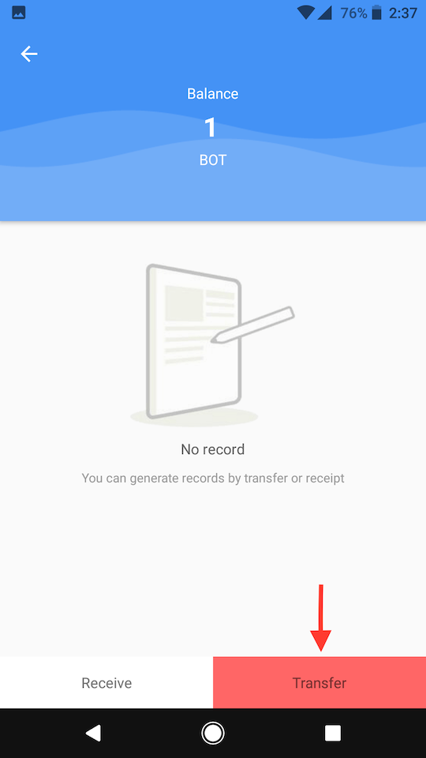
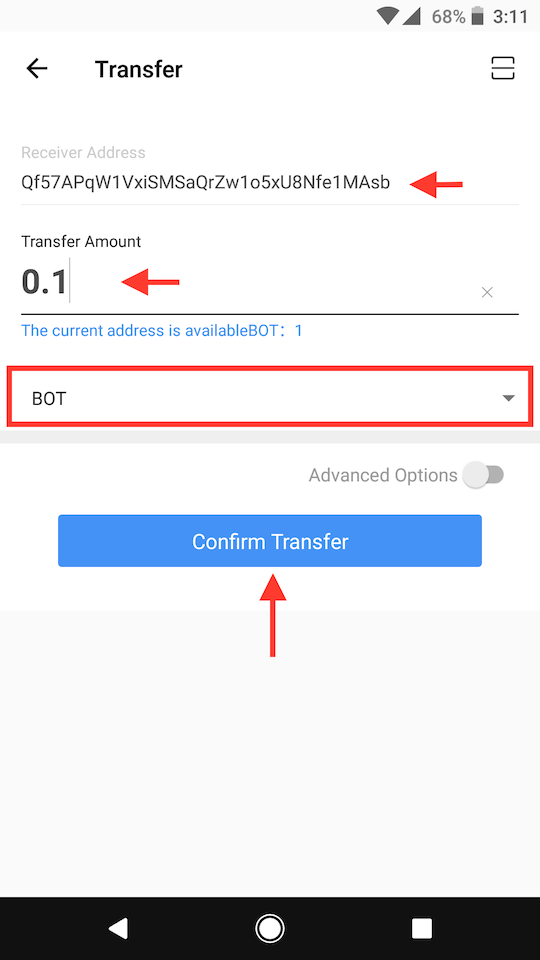
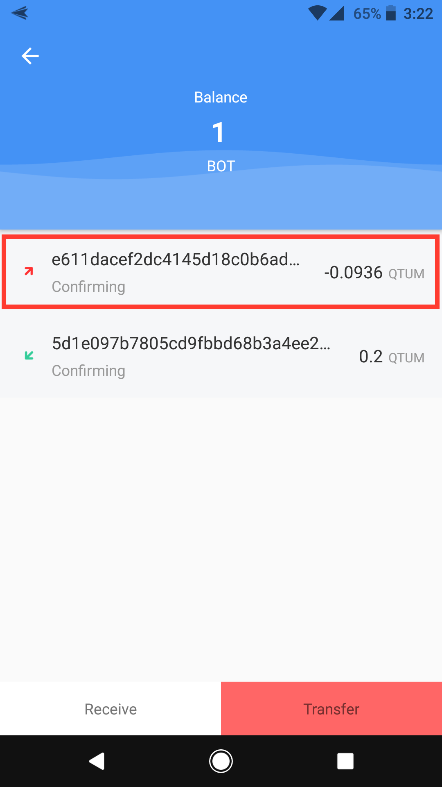

# Downloads
* QBao mobile apps:
    * [Android](https://play.google.com/store/apps/details?id=com.aether.coder.qbao&hl=en)
    * iOS: link coming soon

# Send BOT with QBao mobile app
1. Download and launch the mobile app
2. Click on `BOT` in the list of different tokens
	
	

3. Click on `Transfer` button

	

4. Enter the `Receiver Address` of the person you are sending it to
5. Enter the `Amount` to send in decimal format
6. Make sure `BOT` is selected in the dropdown menu
7. Click the `Confirm Transfer` button

	

8. Wait for your transaction to be mined
	
	

# Receive BOT with QBao mobile app
1. Download and launch the mobile app
2. Click on the `QR Code` button

	

3. Click the `Copy Address` button

	

4. Give that address to the person sending the BOT to you