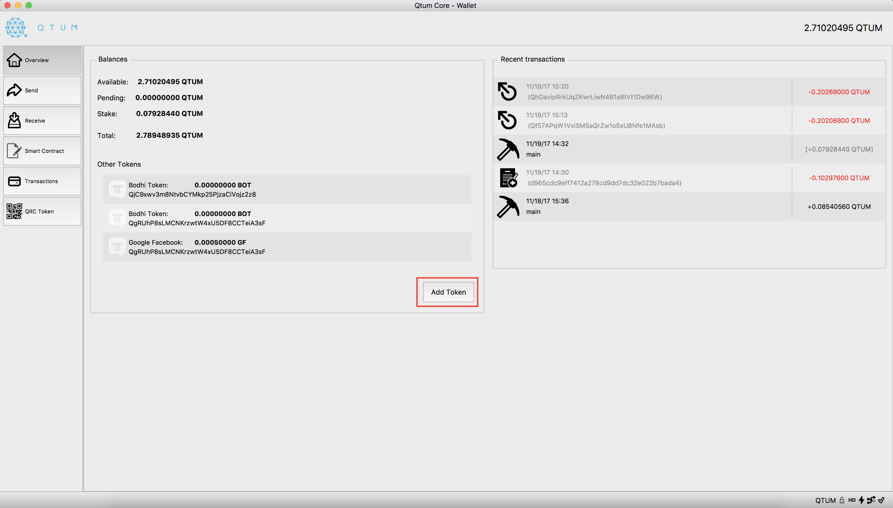
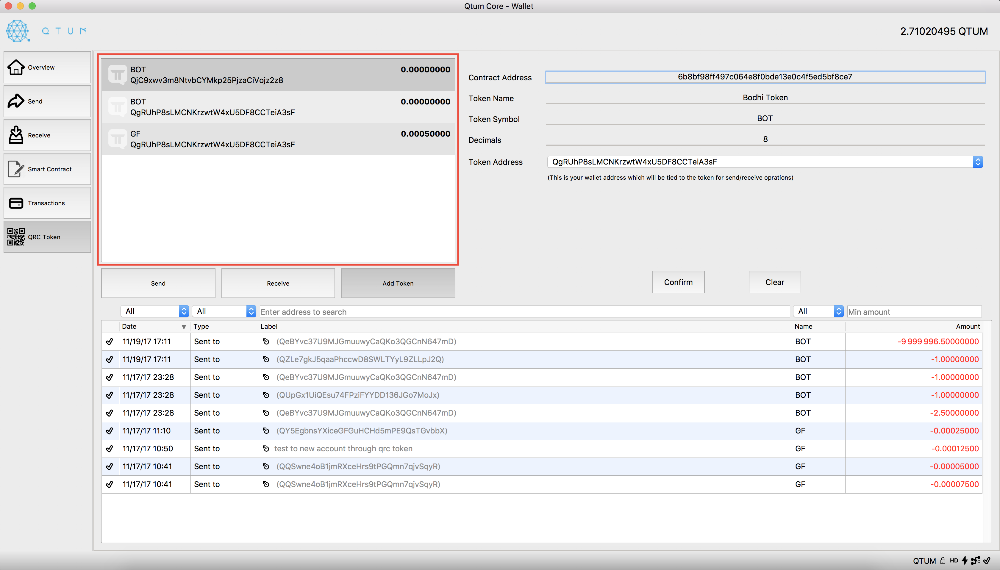
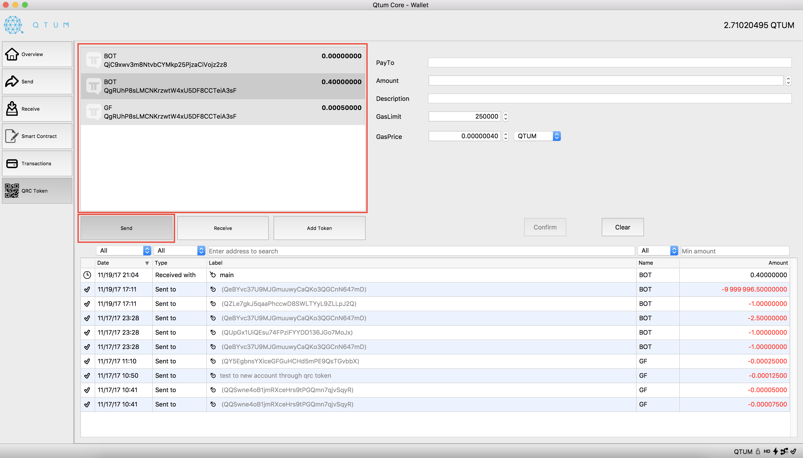
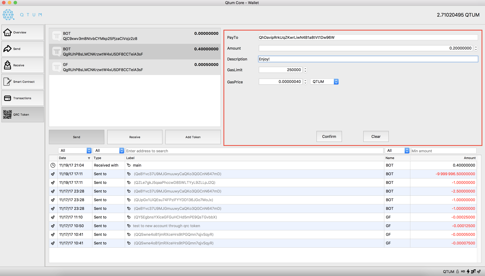
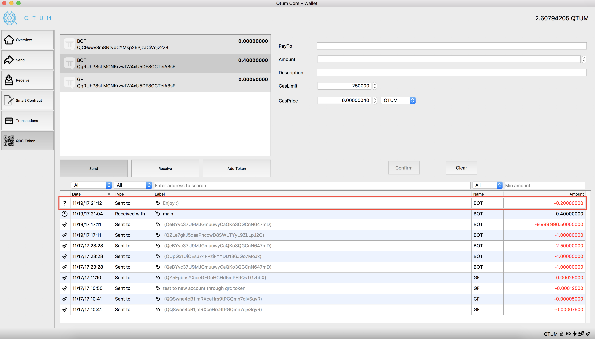
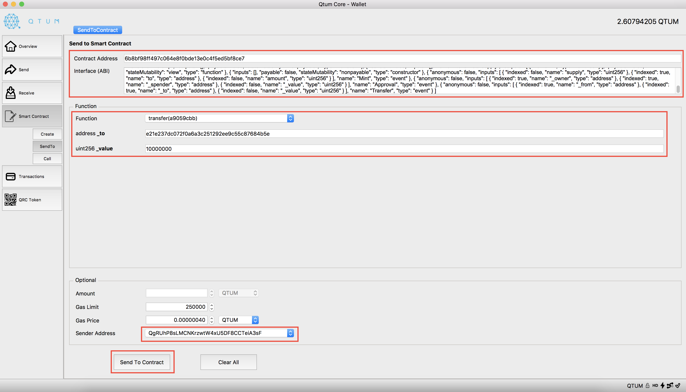

# Downloads
* QT wallet/qtum-cli - find latest release and download installer:
    * [https://github.com/qtumproject/qtum/releases](https://github.com/qtumproject/qtum/releases)

# Launch QT Wallet
In your Terminal window, go to your `qtum-x.xx.x/bin` folder that you installed it in and run:
    
    $ ./qtum-qt --logevents 

Please note you might get a message asking you to reindex. If that is the case, run with this command:

	$ ./qtum-qt --logevents --reindex

# Convert Qtum Address to Hash
1. With QT Wallet open, select Help > Debug window

	

2. Select the Console tab
3. Type the command: `gethexaddress (yourQtumAddress)`
	
	

4. Output is the hash address

	

# Watch BOT
1. [Launch QT Wallet](#launch-qt-wallet)
2. In the `Overview` tab, click the `Add Token` button

	

3. Copy/paste the token address in `Contract Address`
4. Select the `Token Address` which you would like to monitor BOT activity on
5. Click on the `Confirm` button

	

6. You should now see `BOT` being monitored in the `Overview` and `QRC Token` tabs

	

# Send BOT via QRC Token tab (Easy)
1. [Launch QT Wallet](#launch-qt-wallet)
2. [Watch BOT](#watch-bot)
3. In the `QRC Token` tab, click the `Send` button and select an account which contains some BOT

	

4. In the `PayTo` field, add the address you would like to send BOT to
5. In the `Amount` field, type in the amount to send in decimal format
6. (Optional) In the `Description` field, add a note for reference

	

7. Click the `Confirm` button, then a popup window will appear to confirm
8. Wait for the timer in the `Yes` button to finish, then click it

	

9. Wait until your transaction is mined

	

# Send BOT via Smart Contract tab (Harder)
1. [Launch QT Wallet](#launch-qt-wallet)
2. Click on `Smart Contract` > `SendTo`

	

3. Copy/paste the [Contract Address](info.md#deployed-contracts)
4. Copy/paste the [BodhiToken ABI](info.md#interface-abi)
5. Select `Function` > `transfer(a9059cbb)`
6. Get the [hash address](#convert-qtum-address-to-hash) you want to send to and paste it
7. Type in the value as the amount to send (in [Botoshi](info.md#bot-units)) to that address
8. Select the `Sender Address` at the bottom as the address that contains the BOT

	

9. Click the `Send To Contract` button
10. Wait for your transaction to be mined

	

# Receive BOT
1. [Launch QT Wallet](#launch-qt-wallet)
2. Click on `File` > `Receiving addresses...`

	

3. Select the address you would like the BOT sent to then click `Copy`

	

4. Give that address to the person sending the BOT to you
