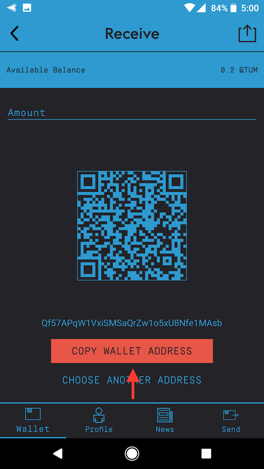

# Downloads
* Qtum mobile apps:
    * [Android](https://play.google.com/store/apps/details?id=org.qtum.wallet&hl=en)
    * [iOS](https://itunes.apple.com/us/app/qtum-wallet/id1277563210?mt=8)

# Watch BOT
1. Download the mobile app and launch it
2. Click on `Profile` tab

	

3. Click on `Smart Contracts`

	

4. Click on `Watch Token`

	

5. Add `Token Name`: BOT
6. Copy/paste the `Token Address` (see [Deployed Contracts](info.md#deployed-contracts) Mainnet address above)
7. Copy/paste the `ABI Interface` (see [Interface (ABI)](info.md#interface-abi) above)
8. Click `OK` button

	

# Send BOT
1. Download the mobile app and launch it
2. Follow steps to [Watch Bot](#watch-bot)
3. Click on `Send` Tab

	

4. Add the `Receiver's Address` of the person you want to send BOT to
5. Click `Choose Token` dropdown and select `BOT`
6. Enter the `Amount` to send in decimal format

	

7. Click the `Send` button
8. Wait for the transaction to be mined

# Receive BOT
1. Download the mobile app and launch it
2. The address shown in the `Wallet` tab is your main address
3. Click on the `+` sign next to the address

	

4. Click on the `Copy Wallet Address` button

	

5. Give that address to the person sending the BOT to you
