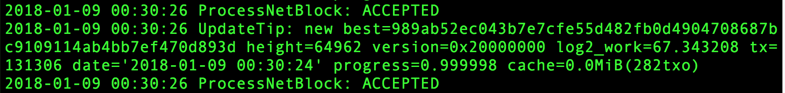

All of our code is open sourced. Developers can follow this guide to get projects set up.

### Prerequisite

1. Download `qtum-x.xx.xx-osx64.tar.gz`  from [https://github.com/qtumproject/qtum/releases](https://github.com/qtumproject/qtum/releases) and unzip it.

2. Then open terminal and enter the directory:
      
         $ cd /qtum-x.xx.xx/bin

3. Run command to start sync.

         $ ./qtumd -testnet -rpcuser=bodhi -rpcpassword=bodhi -logevents 
         # If you want verbose logging, add -printtoconsole

      The terminal should show some info like below

      

4. Open another terminal and cd into the same directory, run command

         $ ./qtum-cli -rpcuser=bodhi -rpcpassword=bodhi -testnet getblockcount       

      it will show the amount you have synced. Then you can open [https://testnet.qtum.org/](https://testnet.qtum.org/) and see the blocks part, when you reached around the number in the first block, your sync is almost done.

5. When sync is done, stop the command in the first terminal by `CTRL+C`

### GraphQL + MongoDB

1. Install MongoDB

      Run following command 

         $ brew update
         $ brew install mongodb
         $ sudo mkdir -p /data/db
         $ sudo chown -R `id -un` /data/db

         $ mongod
         # mongod start MongoDB   

      Open another terminal and type 

         $ mongo
         $ show dbs

      You will see how much storage your database use.

      You can also get some installation help from [Here](https://docs.mongodb.com/manual/administration/install-community/).                

      If you installed docker, you can also start mongodb 

         $ docker run -d -p 27017:27017 mongo

2. Open terminal and run command

         $ git clone https://github.com/bodhiproject/bodhi-graphql.git
         $ cd bodhi-graphql
         $ npm install

3. Start bodhi-graphql at 5555 back to previous terminal and run
         
         $ npm start

      Then play with graphiql on [localhost:5555/graphiql](localhost:5555/graphiql)

4. Run below query in the graphiql website

         query{
           allOracles {
               address,
               topicAddress,
               status,
               token,
               name,
               options,
               optionIdxs,
               amounts,
               resultIdx,
               blockNum,
               endBlock
             },
         }

      If your QTUM is synced, you should get some Oracle objects. Otherwise you can only get an empty array.

### UI

   **UI has dependency on grapghql, api**

1. Clone project

         $ git clone https://github.com/bodhiproject/bodhi-ui.git

2. Installing Packages & Dependencies: `yarn`   
   it will download all the necessary packages and dependencies in to node_modules folder.

3. Run command

         $ npm install

4. Start the app 

         $ yarn start

      After the compiled process completed successfully, it will show success commands & redirect to the http://localhost:3000/ of your browser where you will find the dashboard of the app.

5. To create an optimized product build of the Isomorphic app, you will need to run this build command in your terminal root directory of the app. `yarn build`
