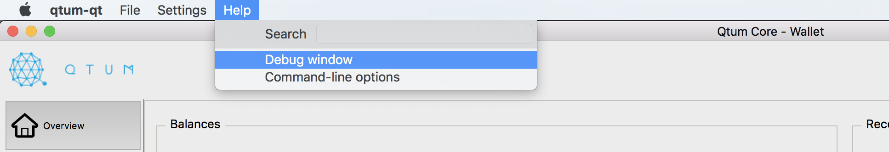
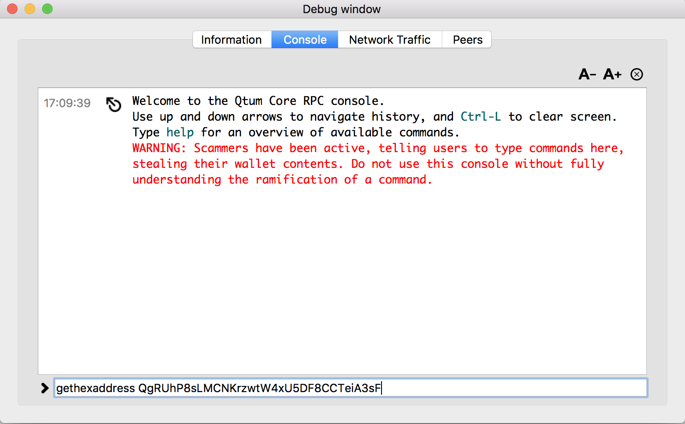
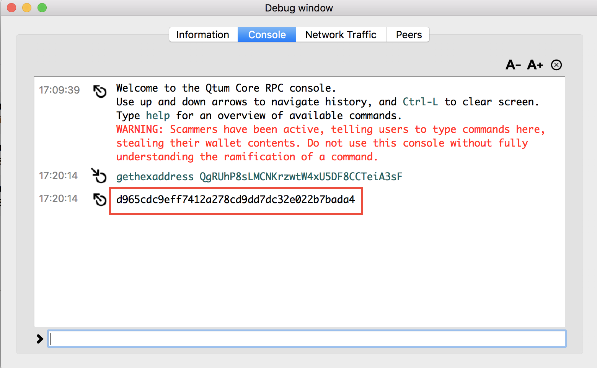

# Downloads
* QT Wallet - find latest release and download installer:
    * [https://github.com/qtumproject/qtum/releases](https://github.com/qtumproject/qtum/releases)

# Launch QT Wallet
In your Terminal window, go to your `qtum-x.xx.x/bin` folder that you installed it in and run:
    
    $ ./qtum-qt --logevents 

Please note you might get a message asking you to reindex. If that is the case, run with this command:

    $ ./qtum-qt --logevents --reindex

# Convert Qtum Address to Hash
1. With QT Wallet open, select `Help` > `Debug window`

    

2. Select the `Console` tab
3. Type the command: `gethexaddress (yourQtumAddress)`
    
    

4. Output is the hash address

    
